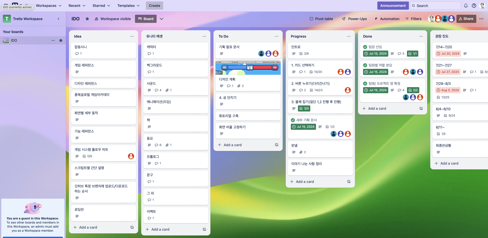
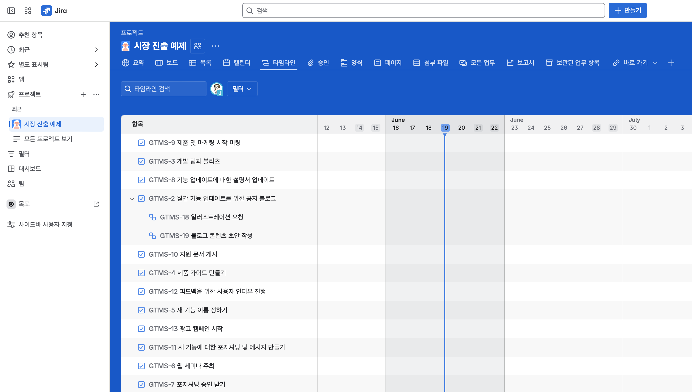
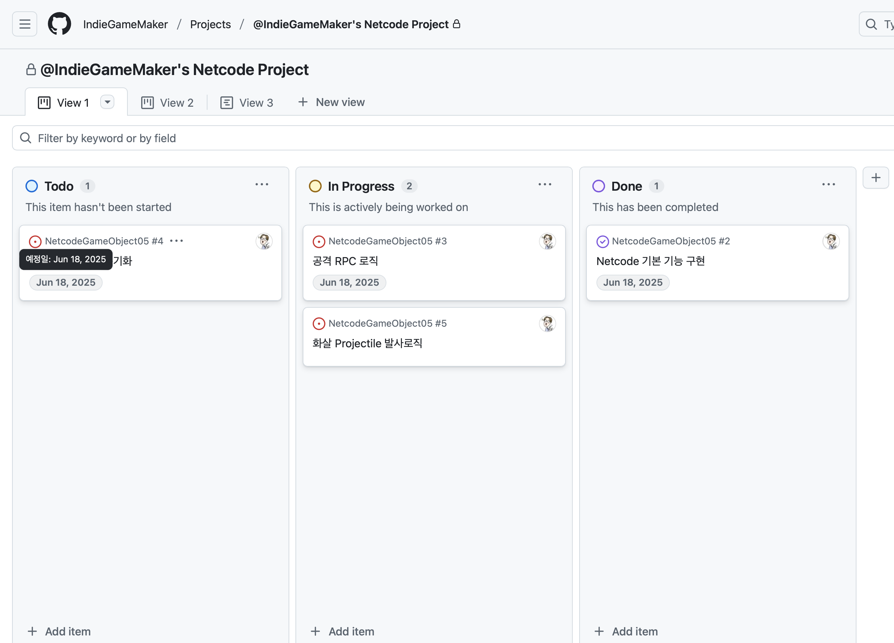
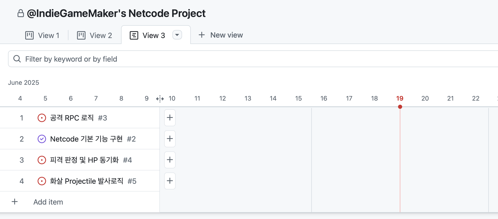
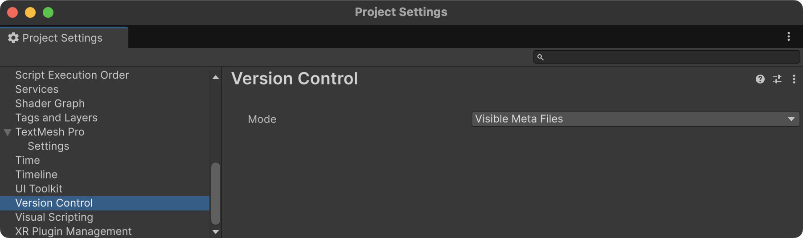
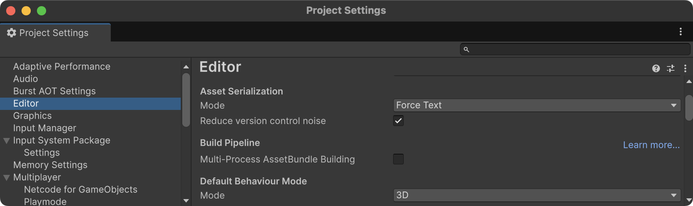
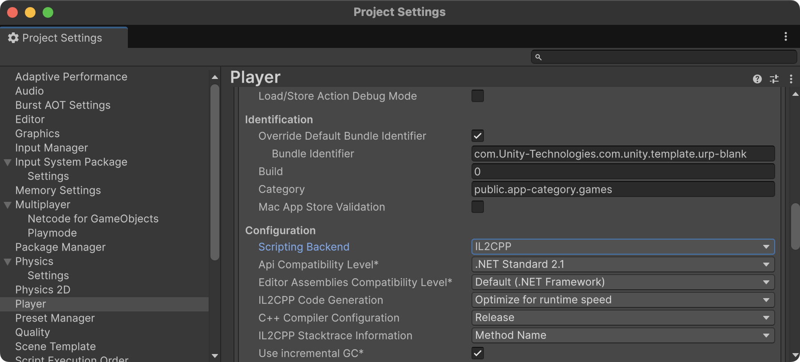
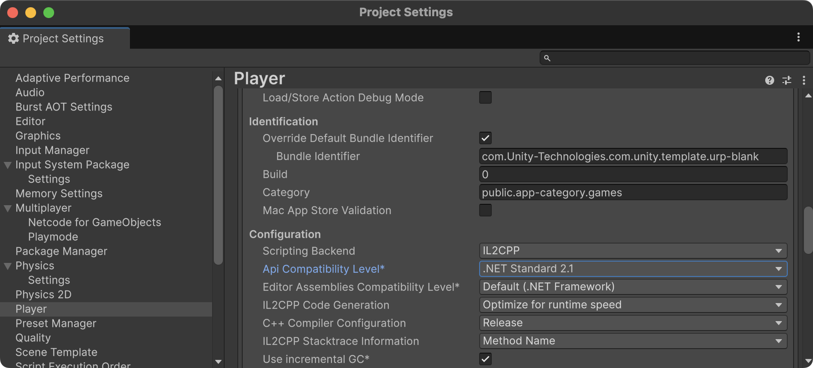

# 팀 스파르타 최종 프로젝트 OT

## 타겟 플랫폼 선정

- 가장 먼저 타겟 플랫폼을 선정 : PC, 모바일, WebGL
- 모바일 플랫폼
  - 안드로이드 : Google Play Store 출시 목표
  - iOS : Apple App Store 출시 목표 (Apple Developer Program 가입 필요)
  - 최적화 작업이 서로 다름
    - 안드로이드 : 텍스처 포맷 ETC2
    - iOS : 텍스처 포맷 PVRTC
  - iOS의 경우 맥 OS(Xcode)에서 빌드해야 함
  - 두개 다 출시를 목표로 한다면 플랫폼 스위칭시 시간소모를 줄이기 위해 Accelerator(Cache Server)를 활용하는 것이 좋음
    - Unity Accelerator 문서 : https://docs.unity3d.com/kr/2021.3/Manual/UnityAccelerator.html
    
- WebGL 플랫폼
  - itch.io 통해 배포
  - 텍스처 포맷 : 
    - ETC2 (WebGL 2.0 지원)
    - PVRTC (WebGL 1.0 지원)
    - 테스트 브라우저 결정(크롬, 엣지)

- 스팀,PC 플랫폼
  - 팀 스파르타 Public Steamworks 계정으로 출시

- 결정된 플랫폼에 따라 리소스 선택이 달라짐
    - 모바일 플랫폼일 경우
      - 3D 모델의 폴리곤 수를 최소화
      - 모바일 최적화 작업 필요

- Unity Project 생성 후 바로 해당 플랫폼으로 변경

## 렌더 파이프라인 선정

- Built-in Render Pipeline : 비추천
  - Unity 6.0 부터 지원 중단됨
  
- Universal Render Pipeline (URP) : 추천
  - 모바일, PC, 콘솔 등 다양한 플랫폼에서 최적화된 성능 제공
  - 모바일 최적화에 유리
  
- High Definition Render Pipeline (HDRP) : 세모
  - 고사양 PC, 콘솔 게임에 적합
  - 스팀 출시를 목표로 한다면 고려 가능
  - 최적화 난이도 높음

## 협업

### 일정관리

- 일정관리 툴 도입이 필요
  - 칸반보드 툴 활용 (Notion, Trello, *Jira* 등)
  - *Github Projects*
  - 트렐로 (사용편의 상, 대규모 프로젝트에는 부적합)
  
  - Jira (프로젝트 관리에 특화, 복잡한 기능)
  
  - *Github Projects* (Github과 통합 관리 가능, Issue와 연동)
  

- 마일스톤 세우기
  
  - 이슈 연동
  
- 이슈 관리
  - Github Issue 기능 적극 활용 (기능 개발, 버그 수정, 문서화 등)
  - 이슈를 통해 작업을 할당하고 진행 상황을 추적

- 위에 언급한 툴은 모두 Slack과 연동 가능
  - Slack을 통해 알림을 받고, 팀원들과 소통 중요함. 반드시 연동할 것

### 업무분담

- 팀원간의 업무 분담
  - 각 팀원의 역할과 책임을 명확히 정의하는 것인 일반적
  - 최종 프로젝트에서는 모든 팀원이 모든 역할을 수행할 수 있도록 하는 것이 목표
  - 역할을 정해두고, 필요시 역할을 변경할 수 있도록 유연하게 운영

### Git 협업

- Branch 전략 수립
  
  - 전략 선택 
    - Git Flow : 대규모 프로젝트에 적합, 기능 개발과 버그 수정을 명확히 분리
    - GitHub Flow : 간단한 프로젝트에 적합, 빠른 배포를 목표로 할 때 사용

  - Git Flow 전략
    - `main` : 배포 가능한 안정 버전
    - `develop` : 개발 중인 기능을 통합하는 브랜치
    - `dev/팀원명` : 팀원별 개발 브랜치
    - `feature/기능명` : 새로운 기능 개발을 위한 브랜치 (옵션)
    - `bugfix/버그명` : 버그 수정 브랜치 (옵션)
    - `hotfix/긴급수정` : 긴급 수정 브랜치 (옵션)

  - Github Flow 전략
    - `main` : 배포 가능한 안정 버전
    - `feature/기능명` : 새로운 기능 개발을 위한 브랜치
    - `bugfix/버그명` : 버그 수정 브랜치 (옵션)
    - `hotfix/긴급수정` : 긴급 수정 브랜치 (옵션)

- main 브랜치 보호 설정
  - main 브랜치에 직접 푸시를 막고, Pull Request를 통해서만 변경 가능하도록 설정
  

  - 또는 git hook을 사용하여 main 브랜치에 직접 푸시를 막을 수 있음
```shell
#!/bin/sh

# main 브랜치로의 push를 차단

while read local_ref local_sha remote_ref remote_sha
do
    branch_name=$(echo "$remote_ref" | sed 's|refs/heads/||')
    if [ "$branch_name" = "main" ]; then
        echo "🚫 main 브랜치로 직접 push할 수 없습니다."
        echo "🔁 Pull Request를 사용해주세요."
        exit 1
    fi
done

exit 0
```

### Git LFS 설정

- .gitignore와 .gitattributes 파일은 처음 프로젝트 생성 후 제일 먼저 설정
- Git LFS 기본 용량은 1GB
- 추후 용량이 부족할 경우 추가 용량 구매 필요 ($5 정도면 50GB 추가 가능)
- 에셋 다운로드 후 사용하지 않는 에셋은 반드시 삭제하는 것을 원칙으로 함
- 다운로드 받은 에셋에서 제공하는 데모 폴더는 반드시 삭제 (git lfs 용량을 낭비함)

## Unity 프로젝트 폴더 구조

- 폴더 명은 PascalCase로 작성
- 폴더 구조는 처음 설정한 후 변경하지 않는 것을 권장
- 폴더 명과 파일명에 공백사용 금지 (언더바(_) 활용)
- 개인별 Sandbox 폴더 운영할 지 여부 결정
  - Sandbox 폴더는 개인별로 자유롭게 실험할 수 있는 공간
  - 팀 프로젝트에서는 Sandbox 폴더를 사용하지 않는 것을 권장
  - 단순히 Git Conflict를 회피하기 위한 목적이라면 반대

### 유니티 버전 통일
- Unity 2022.x , Unity 6.1.x 결정
- 처음 결정한 버전으로 끝까지 진행함
- 필요한 Unity Packages 설치 후 업데이트 하는 경우 주의 필요

### 프로젝트 설정 표준화 (중요 사항)
- Version Control 설정
  - `Edit > Project Settings > Editor`에서 Version Control 설정을 `Visible Meta Files`로 변경
  

- Asset Serialization 설정
  - `Edit > Project Settings > Editor`에서 Asset Serialization 설정을 `Force Text`로 변경
  

- Script Backend 설정
  - `Edit > Project Settings > Player`에서 Scripting Backend을 `IL2CPP`로 설정
  

- API Compatibility Level 설정
  - `Edit > Project Settings > Player`에서 API Compatibility Level을 `.NET Standard 2.1`로 설정
  