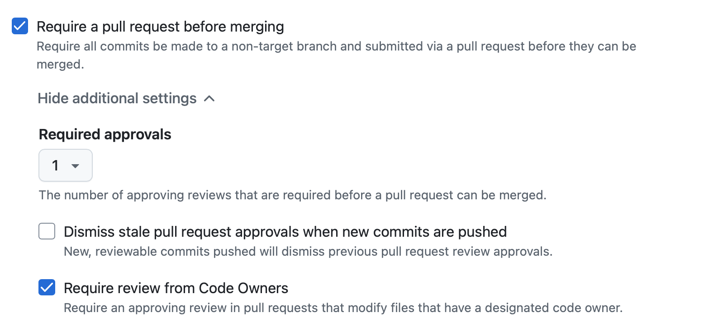

# 팀 스파르타 최종 프로젝트 OT

## 타겟 플랫폼 선정

- 가장 먼저 타겟 플랫폼을 선정해야 합니다.
- PC, 모바일, WebGL 중 하나를 선택합니다.
- 모바일 플랫폼일 경우
  - 안드로이드 : Google Play Store 출시 목표
  - iOS : Apple App Store 출시 목표 (Apple Developer Program 가입 필요)
  - 최적화 작업이 서로 다름
    - 안드로이드 : 텍스처 포맷 ETC2
    - iOS : 텍스처 포맷 PVRTC
  - iOS의 경우 맥 OS(Xcode)에서 빌드해야 함
    
- WebGL 플랫폼일 경우
  - itch.io 통해 배포
  - 텍스처 포맷 : 
    - ETC2 (WebGL 2.0 지원)
    - PVRTC (WebGL 1.0 지원)
    - 테스트 브라우저 결정(크롬, 엣지)

- 스팀 플랫폼 일 경우
  - 팀 스파르타 Public Steamworks 계정으로 출시

- 처음부터 타겟 플랫폼으로 설정하고 개발을 시작해야 합니다.

- 결정된 플랫폼에 따라 리소스 선택이 달라짐
    - 모바일 플랫폼일 경우
      - 3D 모델의 폴리곤 수를 최소화
      - 모바일 최적화 작업 필요

## 렌더 파이프라인 선정

- Built-in Render Pipeline : 비추천
- Universal Render Pipeline (URP) : 추천
  - 모바일, PC, 콘솔 등 다양한 플랫폼에서 최적화된 성능 제공
  - 모바일 최적화에 유리
- High Definition Render Pipeline (HDRP) : 세모
  - 고사양 PC, 콘솔 게임에 적합
  - 스팀 출시를 목표로 한다면 고려 가능

## 협업

### 일정관리

- 일정관리 툴 도입이 필요
  - Notion, Trello, *Jira* 등
  - *Github Projects*
  - 트렐로 (사용편의 상)
  
  - Jira (프로젝트 관리에 특화, 복잡한 기능)
  
  - *Github Projects* (Github과 통합 관리 가능, Issue와 연동)
  

- 마일스톤 세우기
  
  - 이슈 연동
  
- 이슈 관리
  - Github Issue 기능 적극 활용 (기능 개발, 버그 수정, 문서화 등)
  - 이슈를 통해 작업을 할당하고 진행 상황을 추적

## 업무분담

- 팀원간의 업무 분담
  - 각 팀원의 역할과 책임을 명확히 정의하는 것인 일반적
  - 최종 프로젝트에서는 모든 팀원이 모든 역할을 수행할 수 있도록 하는 것이 목표
  - 역할을 정해두고, 필요시 역할을 변경할 수 있도록 유연하게 운영

## Git 협업

- Branch 전략 수립
  
  - 전략 선택 
    - Git Flow : 대규모 프로젝트에 적합, 기능 개발과 버그 수정을 명확히 분리
    - GitHub Flow : 간단한 프로젝트에 적합, 빠른 배포를 목표로 할 때 사용

  - Git Flow 전략
    - `main` : 배포 가능한 안정 버전
    - `develop` : 개발 중인 기능을 통합하는 브랜치
    - `dev/팀원명` : 팀원별 개발 브랜치
    - `feature/기능명` : 새로운 기능 개발을 위한 브랜치 (옵션)

  - Github Flow 전략
    - `main` : 배포 가능한 안정 버전
    - `feature/기능명` : 새로운 기능 개발을 위한 브랜치
    - `bugfix/버그명` : 버그 수정 브랜치 (옵션)
    - `hotfix/긴급수정` : 긴급 수정 브랜치 (옵션)

- main 브랜치 보호 설정
  - main 브랜치에 직접 푸시를 막고, Pull Request를 통해서만 변경 가능하도록 설정
  
  
  - 또는 git hook을 사용하여 main 브랜치에 직접 푸시를 막을 수 있음
```shell
#!/bin/sh

# main 브랜치로의 push를 차단

while read local_ref local_sha remote_ref remote_sha
do
    branch_name=$(echo "$remote_ref" | sed 's|refs/heads/||')
    if [ "$branch_name" = "main" ]; then
        echo "🚫 main 브랜치로 직접 push할 수 없습니다."
        echo "🔁 Pull Request를 사용해주세요."
        exit 1
    fi
done

exit 0
```