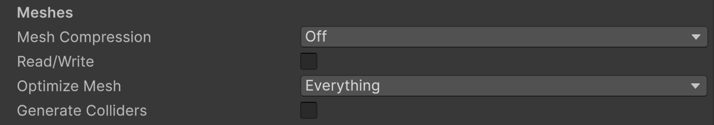
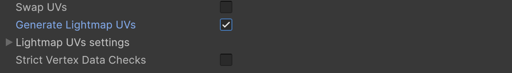

# 팀 스파르타 최종 프로젝트 OT

## 타겟 플랫폼 선정

- PC(스팀), 모바일, WebGL
  
- PC 플랫폼
  - 팀 스파르타 Public Steamworks 계정으로 출시
  - PC 플랫폼이라고 하더라도 **최적화** 염두에 두어야 함
  - 목표 FPS
    - FPS, 액션 : 60fps 이상
    - RPG, 어드벤처 : 30fps 이상
    - 개발중 무제한 설정 
      - QualitySettings.vSyncCount = 0;   // 수직 동기화 끄기
      - Application.targetFrameRate = -1; // 프레임 제한 해제
    - 빌드시점에 목표 프레임 명시 
      - Application.targetFrameRate = 60;
  
- 모바일 플랫폼
  - 안드로이드 : Google Play Store 출시 목표
  - iOS : Apple App Store 출시 목표 (Apple Developer Program 가입 필요)
  - 최적화 작업이 서로 다름
    - 안드로이드 : 텍스처 포맷 ETC2
    - iOS : 텍스처 포맷 PVRTC
  - iOS의 경우 맥 OS(Xcode)에서 빌드해야 함
  - 두개 다 출시를 목표로 한다면 플랫폼 스위칭시 시간 소모를 줄이기 위해 Accelerator(Cache Server)를 활용
    - Unity Accelerator 문서 : https://docs.unity3d.com/kr/2021.3/Manual/UnityAccelerator.html
  - 3D 모델의 폴리곤 수를 최소화
  - 모바일 최적화 작업 필요
  - 목표 DrawCall 수 : 100 ~ 200개
  - 목표 FPS : 30 ~ 60fps

- WebGL 플랫폼
  - itch.io 통해 배포
  - 텍스처 포맷 : 
    - ETC2 (WebGL 2.0 지원)
    - PVRTC (WebGL 1.0 지원)
    - **테스트 브라우저** 결정(크롬, 엣지)

- 결정된 플랫폼에 따라 리소스 선택이 달라짐
- Unity Project 생성 후 바로 해당 플랫폼으로 변경

---

## 렌더 파이프라인 선정

- Built-in Render Pipeline : 사용금지
  - Unity 6.0 부터 지원 중단됨
  
- **Universal Render Pipeline (URP) : 추천**
  - 모바일, PC, 콘솔 등 다양한 플랫폼에서 최적화된 성능 제공
  - 모바일 최적화에 유리
  
- High Definition Render Pipeline (HDRP) : 비추천
  - 고사양 PC, 콘솔 게임에 적합
  - 스팀 출시를 목표로 한다면 고려 가능
  - 최적화 난이도 높음

---

## 프로젝트 기획 및 설계

### 기획 문서 작성 (기획 튜터님께...)
- 기획 문서는 Notion, Google Docs 등 협업 도구를 사용하여 작성
- 기획 문서에는 게임의 기본 개념, 목표, 주요 기능, 게임 플레이 방식 등을 포함
- 기획 문서는 팀원 모두가 접근할 수 있도록 공유하고, 지속적으로 업데이트

- 기획 문서 예시
  - 게임 개요
    - 게임 제목, 장르, 플랫폼 등 기본 정보
  - 게임 목표
    - 게임의 목표와 플레이어가 달성해야 할 목표
  - 게임 플레이 방식
    - 게임의 기본적인 플레이 방식과 조작 방법
  - 주요 기능
    - 게임의 주요 기능과 시스템 설명
  - 아트 스타일
    - 게임의 비주얼 스타일과 아트 방향성  
  - 레벨 디자인
    - 게임 레벨의 구조와 디자인 방향성
    - 레벨별 목표와 난이도

### 시스템 설계
- 게임의 구조와 기능을 정의하는 단계
- 설계 문서에는 게임의 주요 시스템, 데이터 구조, 인터페이스 등을 포함
- 팀원 모두가 이해할 수 있도록 명확하게 작성
- 시스템 설계 문서 예시
  
  - 게임 시스템 (플로우차트) : **필수**
    - 게임의 주요 로직과 흐름 정의 (예: 게임 시작, 게임 오버, 레벨 전환 등)
    - 이벤트 시스템 설계 (필요한 경우)
    - 게임 상태 관리 (예: 게임 시작, 일시 정지, 게임 종료 등)
  
  - 인터페이스 설계 (와이어프레임): **필수**
    - 게임의 사용자 인터페이스(UI) 설계 (예: 메뉴, HUD, 인벤토리 등)
    - UI 요소의 배치와 상호작용 정의
  
  - 데이터 구조 (UML 다이어그램, ERD 등) : **옵션**
    - 게임에서 사용하는 데이터 구조와 형식 정의 (예: 플레이어 데이터, 적 데이터, 아이템 데이터 등)
    - 데이터베이스 구조 정의
      - 예: JSON, ScriptableObject 등
      - 데이터베이스 사용 시, 데이터베이스 스키마 정의
    - 스토리지 서비스 선택할 경우 (예: **UGS**, **Google Cloud**, PlayFab 등)
    - 직접 구현 선택할 경우(Nginx, Node.js, MySQL(MariaDB) 등)
  
  - 인증 시스템 설계 (로그인 로직이 있는 경우) : **게임 시스템 문서에 포함**
    - 직접 구현 vs **외부 인증 서비스** 
    - 인증 서비스 선택 (예: **UGS**, Firebase, PlayFab 등)
    - 사용자 인증 방식 정의 (예: Anonymous, ID/Passwd, 이메일, 소셜 로그인 등)
    - 사용자 데이터 관리 (예: 프로필, 저장 데이터 등)
  
  - 네트워크 설계 (멀티플레이어 게임인 경우) : **게임 시스템 문서에 포함**
    - 네트워크 엔진 선택 (Netcode, Photon PUN2, Fusion2, Mirror 등)
    - 로비, 매치메이킹, 게임 룸 관계 설계
    - 데이터 동기화(RPC, Event) 및 상태(Custome Property) 동기화 관리
  
  - 네트워크 엔진 직접 제작할 경우 (백앤드 개발자로 취업하고 싶다면)
    - TCP, UDP 비동기 통신 방식 (난이도 중)
    - IOCP (난이도 상)

  - 테스트 계획 : **중간 점검 이후**
    - 각 시스템과 기능에 대한 테스트 계획 수립
    - UGS Analytics 활용한 분석 데이터 수집
    - A/B 테스트 계획 수립

---

## 협업

### 일정 관리

- 일정 관리 툴 도입
  - 칸반보드 툴 활용 (Notion, Trello, **Jira** 등)
  - **Github Projects** : Github Issue와 연동하여 프로젝트 관리 가능
  - 트렐로 (사용편의 상, 대규모 프로젝트에는 부적합)
  

  - Jira (프로젝트 관리에 특화, 복잡한 기능)
  

  - **Github Projects** (Github과 통합 관리 가능, Issue와 연동)
  

- 마일스톤 세우기
  
  - 이슈 연동
  
- 이슈 관리
  - Github Issue 기능 적극 활용 (기능 개발, 버그 수정, 문서화 등)
  - 이슈를 통해 작업을 할당하고 진행 상황을 추적
  - 커밋 메시지에서 Issue 번호를 참조하여 작업 추적
    - `git commit -m "fix: #13: 버그 수정 내용"`
    - `git commit -m "feat: #02: 새로운 기능 추가 내용"`
    - `git commit -m "feat: 로그인 기능 완성 closed #20"`

- 위에 언급한 툴은 모두 **Slack과 연동 가능**
  - Slack을 통해 알림을 받고, 팀원들과 소통 중요함. 반드시 연동할 것

### 업무 분담

- 팀원간의 업무 분담 (공평한 업무 분담)
  - 각 팀원의 역할과 책임을 명확히 정의하는 것이 일반적
  - 최종 프로젝트에서는 모든 팀원이 모든 역할을 수행할 수 있도록 하는 것이 목표
  - 역할을 정해두고, 필요시 역할을 변경할 수 있도록 유연하게 운영
  - 기술적 난이도가 높은 부분에 도전 (BT, A*, 네트워크, 백앤드, 인증, ...)

## Git

### Branch 전략 수립
  
- 전략 선택 
  - Git Flow : 대규모 프로젝트에 적합, 기능 개발과 버그 수정을 명확히 분리
  - GitHub Flow : 간단한 프로젝트에 적합, 빠른 배포를 목표로 할 때 사용

- Git Flow 전략
  - `main` : 배포 가능한 안정 버전
  - `develop` : 개발 중인 기능을 통합하는 브랜치
  - `dev/팀원명` : 팀원별 개발 브랜치
  - `feature/기능명` : 새로운 기능 개발을 위한 브랜치 (옵션)
  - `bugfix/버그명` : 버그 수정 브랜치 (옵션)
  - `hotfix/긴급수정` : 긴급 수정 브랜치 (옵션)

- Github Flow 전략
  - `main` : 배포 가능한 안정 버전
  - `feature/기능명` : 새로운 기능 개발을 위한 브랜치
  - `bugfix/버그명` : 버그 수정 브랜치 (옵션)
  - `hotfix/긴급수정` : 긴급 수정 브랜치 (옵션)

- main 브랜치 보호 설정
  - main 브랜치에 직접 푸시를 막고, Pull Request를 통해서만 변경 가능하도록 설정
  

  - 또는 git hook을 사용하여 main 브랜치에 직접 푸시를 막을 수 있음
  
```shell
#!/bin/sh

# main 브랜치로의 push를 차단

while read local_ref local_sha remote_ref remote_sha
do
    branch_name=$(echo "$remote_ref" | sed 's|refs/heads/||')
    if [ "$branch_name" = "main" ]; then
        echo "🚫 main 브랜치로 직접 push할 수 없습니다."
        echo "🔁 Pull Request를 사용해주세요."
        exit 1
    fi
done

exit 0
```

### C# 코드 컨벤션 설정
  - 서로 다른 Editor 사용시 (Visual Studio, Rider, VSCode 등)
  - **UTF-8 인코딩** 설정
  - `.editorconfig` 파일을 프로젝트 루트에 추가하여 코드 스타일 통일
  - [참고](https://unity.com/kr/how-to/formatting-best-practices-c-scripting-unity)

### Git LFS 설정

- .gitignore와 .gitattributes 파일은 처음 프로젝트 생성 후 제일 먼저 설정
- Git LFS 기본 용량은 1GB
- 추후 용량이 부족할 경우 추가 용량 구매 필요 ($5 정도면 50GB 추가 가능)
- 에셋 다운로드 후 사용하지 않는 에셋은 반드시 삭제하는 것을 원칙으로 함
- 다운로드 받은 에셋에서 제공하는 **데모 폴더는 반드시 삭제** (git lfs 용량을 낭비함)

## Unity 프로젝트 폴더 구조

- 폴더 명은 **PascalCase**로 작성
- 폴더 구조는 처음 설정한 후 **변경금지**
- 폴더 명과 파일명에 **공백사용 금지** (언더바(_) 활용)
- 개인별 Sandbox 폴더 운영할 지 여부 결정
  - Sandbox 폴더는 개인별로 자유롭게 실험할 수 있는 공간
  - 팀 프로젝트에서는 Sandbox 폴더를 사용하지 않는 것을 권장
  - 단순히 Git Conflict를 회피하기 위한 목적이라면 반대

### 유니티 버전 통일
- Unity 2022.x , **Unity 6.1.x** 결정
- 처음 결정한 버전으로 끝까지 진행함(**유니티 버전업 금지**)
- Unity 6 에디터 변경사항 [참고 유니티코리아](https://www.youtube.com/watch?v=VWoG-u6Lb7g&t=2s)

### Scene 작업 규칙
- Scene 병합 충돌 방지를 위한 팀원간의 약속 정의(슬랙으로 노티)
- Scene을 분리해서 분리된 씬에서 작업
  - 예: `MainMenu`, `GamePlay`, `GameUI`, `Level01`, `Level02` 등

    ```csharp
    // 멀티 씬 로딩
    LoadScene("Level01"");
    LoadScene("GameUI", LoadSceneMode.Additive);
    LoadScene("GamePlay", LoadSceneMode.Additive);
    ```
### InputSystem 사용
- 레거시 InputManager 비추천
- InputSystem 사용 권장 
  - Player Input 컴포넌트 비추천 
  - C# Wrapper를 사용 (C# 이벤트 바인딩해서 사용 권장)

### 커스텀 에디터
- 간단한 기능은 추천
- 스케일이 큰 커스텀 에디터는 권장하지 않음 (주객이 전도)
- 커스텀 에디터를 사용한다면 반드시 팀원들과 상의 후 결정

### 디자인 패턴 도입
- 일반적인 디자인 패턴 도입
  - 싱글톤, 옵저버, 팩토리, 커맨드, 상태 패턴, 이벤트버스 등
- 특이한 디자인 패턴 도입은 팀원들과 상의 후 결정
- **엔티티 컴포넌트 시스템 (ECS)** 도입은 권장하지 않음

### UniTask 비추천
- UniTask: 장점에 비해 학습 곡선이 가파르고, 코드 가독성을 저하시킬 수 있음
- Unity의 기본 `Coroutine`을 사용하여 비동기 작업을 처리하는 것을 권장

### 공통 Update 루틴 비추천
- 기본 `Update`, `FixedUpdate`, `LateUpdate` 대신 별도의 공통 Tick 루틴을 구현하는 것은 권장하지 않음
- 일관성이 무너지면 득보다 실이 많음
- 프레임워크 제작에 시간을 낭비하기보다는 게임 로직에 집중하기를 권장

### 라이트매핑, 라이트 프로브, 리플렉션 프로브
- 라이트매핑을 적용한다면 처음 스테이지가 완성된 후 부터 적용해야 함
- 나중에 할 시간이 없음
- 라이트매핑 적용 여부는 담당튜터와 상의 후 결정
 
### 최적화는 처음부터
- 텍스처 해상도 (512, 1024, 2048), 포맷(ETC2, PVRTC 등) 결정
- 폴리곤 수 확인 (에셋 선정과정)
- 3D 모델의 Import Settings > Read/Write 언체크 
- 3D 모델의 Import Settings > Mesh Compression 설정
  

- 3D 모델의 Import Settings > Generate Lightmap UVs 설정
  - 라이트매핑을 적용할 경우 반드시 설정  
    

### 프로젝트 설정 표준화 (중요 사항)
- Version Control 설정
  - `Edit > Project Settings > Editor`에서 Version Control 설정을 `Visible Meta Files`로 변경
  

- Asset Serialization 설정
  - `Edit > Project Settings > Editor`에서 Asset Serialization 설정을 `Force Text`로 변경
  

- Script Backend 설정
  - `Edit > Project Settings > Player`에서 Scripting Backend을 `IL2CPP`로 설정
  

- API Compatibility Level 설정
  - `Edit > Project Settings > Player`에서 API Compatibility Level을 `.NET Standard 2.1`로 설정
  

---

